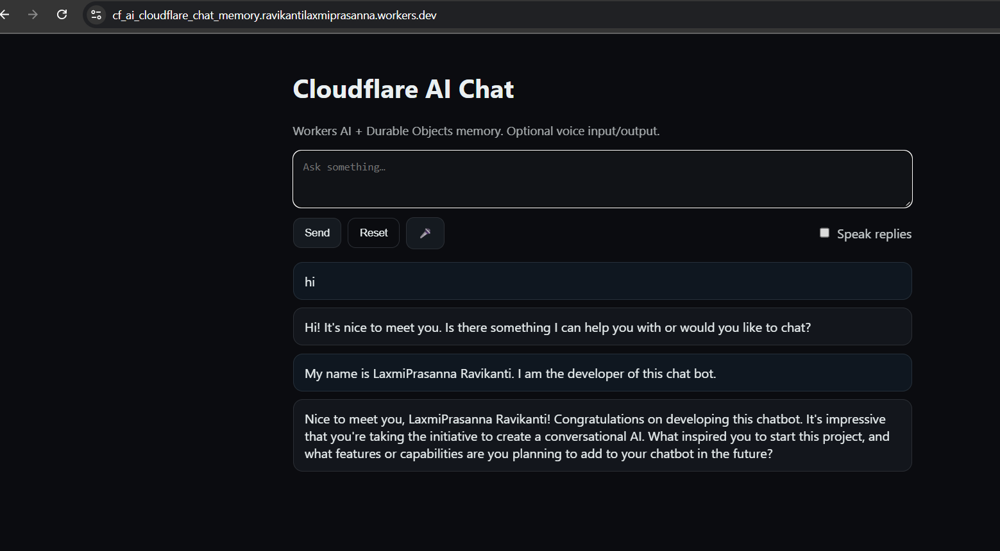

# cf_ai_cloudflare_chat_memory

Live demo: 🌐 Try it here((https://cf_ai_cloudflare_chat_memory.ravikantilaxmiprasanna.workers.dev))

A minimal AI-powered chat app built on Cloudflare Workers AI with Durable Objects memory and optional voice input/output.
Created as part of the Cloudflare AI assignment.

✅ Features

LLM (Workers AI): Uses @cf/meta/llama-3-8b-instruct.

Workflow / Coordination: Durable Object manages per-user conversation state and memory.

User Input: Web chat UI with text, plus optional voice input (speech-to-text) and speech replies (text-to-speech) via the browser’s Web Speech API.

Memory / State: Conversation history is persisted per session.

🚀 Quick Start
1) Prerequisites

Node.js 18+

Cloudflare account (with Workers + Workers AI enabled)

Wrangler CLI:

npm install -g wrangler

2) Install
npm install

3) Configure

Edit your wrangler.toml and replace with your Cloudflare account_id:

account_id = "YOUR_ACCOUNT_ID"

Set the AI model (default):

AI_MODEL = "@cf/meta/llama-3-8b-instruct"

4) Run locally
npm run dev

Open: http://localhost:8787

5) Deploy
npm run deploy

The deploy command will print your production URL.

🖥️ Architecture
Browser ⇄ Worker (API routes)
│
├── /api/chat    → Durable Object session → Workers AI (LLM)
├── /api/history → Retrieve conversation history
└── /api/reset   → Clear session history

Worker (src/worker.ts) – Handles API endpoints.

Durable Object (src/memory.ts) – Stores and trims conversation history.

Frontend (public/) – Chat UI with optional voice input/output.

🎙️ Voice Support

Voice Input: Uses the browser’s built-in SpeechRecognition API (Chrome recommended).

Voice Output: Uses SpeechSynthesis API to speak replies aloud.

No server cost – handled fully client-side.

📂 Repo Checklist

README.md ✅ (this file)

PROMPTS.md ✅ (logs AI prompts used in building this project)

Live deployed link ✅

Repo name starts with cf_ai_ ✅

📸 Screenshots

Add your demo screenshots here (e.g. from workers.dev link).

Notes

If @cf/meta/llama-3-8b-instruct is not available on your account, pick another model from:

npx wrangler ai models

Tested on Chrome (voice features).